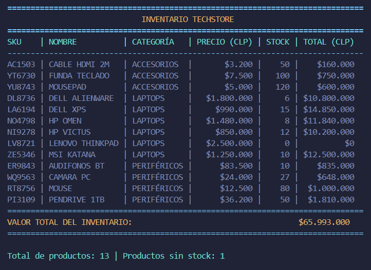
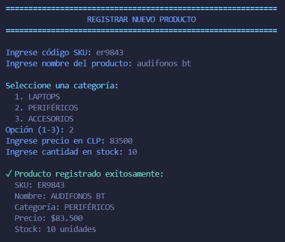
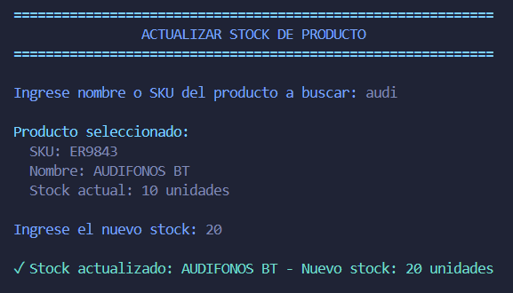
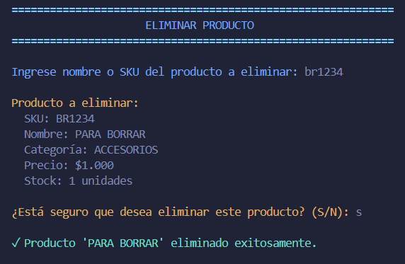
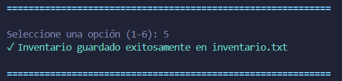
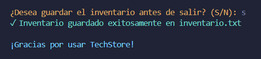

# TechStore - Sistema de Gestión de Inventario

## Índice
- [Autor](#autor)
- [Descripción del Proyecto](#descripción-del-proyecto)
- [Estructura del Proyecto](#estructura-del-proyecto)
- [Funcionalidades Implementadas](#funcionalidades-implementadas)
- [Uso del Sistema](#uso-del-sistema)
- [Ramas del Proyecto](#ramas-del-proyecto)

---

## Autor
**Desarrollado por**: Leandro Marchant A.  
**Tipo**: Proyecto Educativo  
**Módulo**: Desarrollo Python (Vanilla)  
**Programa**: Fullstack Python - Talento Digital  
**Año**: 2025

---

## Descripción del Proyecto
El **Sistema de Gestión de Inventario de TechStore** es una aplicación desarrollada como proyecto educativo del programa **Fullstack Python - Talento Digital 2025**. Permite administrar productos mediante operaciones CRUD con persistencia en archivos JSON.

### El Desafío
Desarrollar un sistema que permita a TechStore gestionar su inventario de productos tecnológicos de manera eficiente, con validación de datos, búsqueda flexible y persistencia de información.

### Conceptos de Python Aplicados
- Funciones con parámetros y valores de retorno
- Listas, diccionarios, tuplas y sets
- Manejo de excepciones (try-except)
- Lectura y escritura de archivos JSON
- Validación de entrada de usuario
- Formateo de strings y números
- Modularización del código
- Constantes y códigos de color ANSI

---

## Estructura del Proyecto
El proyecto está organizado de la siguiente manera:

```
techstore/
│
├── main.py              # Punto de entrada del programa
├── inventario.py        # Gestión de carga y guardado de datos
├── operaciones.py       # Funciones CRUD del inventario
├── utils.py             # Funciones auxiliares y constantes
├── README.md            # Documentación del proyecto
│
└── inventario/
    └── inventario.txt   # Almacenamiento de productos (JSON)
```

---

## Funcionalidades Implementadas

### 1. Visualizar Inventario
- Muestra todos los productos en formato tabla ordenada por categoría y nombre
- Calcula automáticamente el valor total del inventario
- Anchos dinámicos de columnas que se adaptan al contenido



### 2. Registrar Producto
- Validación de SKU único (sin duplicados)
- Campos: SKU, nombre, categoría, precio y stock
- Categorías predefinidas: LAPTOPS, PERIFÉRICOS, ACCESORIOS



### 3. Actualizar Stock
- Búsqueda flexible por nombre parcial o SKU exacto
- Selección de producto en caso de múltiples coincidencias
- Actualización inmediata del stock



### 4. Eliminar Producto
- Búsqueda de producto con selección interactiva
- Confirmación antes de eliminar
- Actualización del conjunto de SKUs usados



### 5. Guardar Inventario
- Persistencia en formato JSON con codificación UTF-8
- Guardado automático al salir (opcional)
- Respaldo automático de archivos corruptos



### 6. Menú Principal y Fin de ejecución
- Navegación sencilla entre opciones
- Mensajes informativos y de error con símbolos visuales
- Opción para guardar cambios antes de salir




---

## Uso del Sistema

### Requisitos
- Python 3.6 o superior
- Módulos estándar: `json`, `shutil`, `os`

### Ejecución

```bash
python main.py
```

### Flujo de Uso
1. Al iniciar, el sistema carga automáticamente el inventario desde `inventario/inventario.txt`
2. El menú presenta 6 opciones numeradas
3. Seleccionar la opción deseada ingresando el número correspondiente
4. Seguir las instrucciones en pantalla para cada operación
5. Al salir, el sistema pregunta si desea guardar los cambios

### Ejemplo de Datos

```json
{
  "sku": "ZE5346",
  "nombre": "MSI KATANA",
  "categoria": "LAPTOPS",
  "precio": 1250000,
  "stock": 10
}
```

---

## Ramas del Proyecto
El proyecto utiliza las siguientes ramas:

| Rama          | Descripción                                                            | Estado   |
| ------------- | ---------------------------------------------------------------------- | -------- |
| `main`        | Rama principal de producción                                           | Activa   |
| `docs`        | Documentación del proyecto                                             | Mergeada |
| `inventario`  | Sistema de carga y guardado de inventario con respaldo automático      | Mergeada |
| `operaciones` | Funciones CRUD: registrar, visualizar, actualizar y eliminar productos | Mergeada |
| `utils`       | Constantes ANSI, funciones auxiliares y validaciones                   | Mergeada |

### Convenciones de Commits

El proyecto sigue las convenciones de commits semánticos:

- `feat:` Nueva funcionalidad
- `fix:` Corrección de bugs
- `refactor:` Refactorización de código
- `docs:` Actualización de documentación

---
